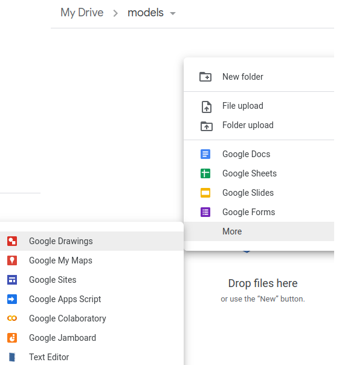
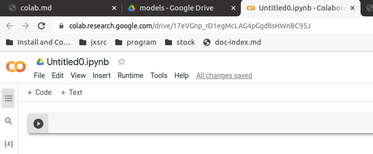
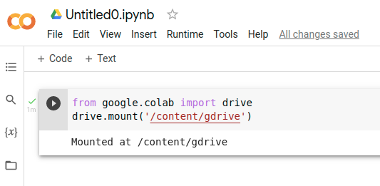
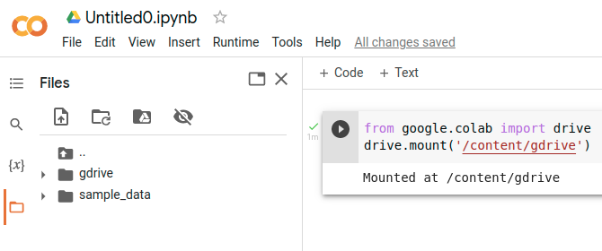
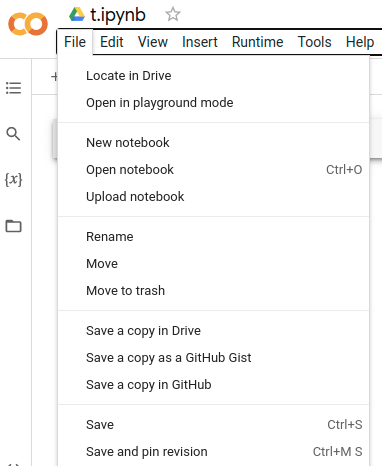
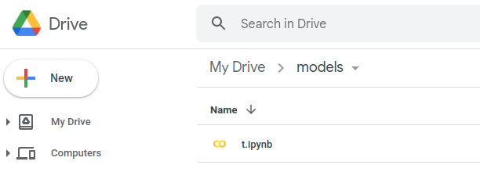

# Google Colab

## Login Google Drive and Google Colab

1. Go to [https://drive.google.com/drive/my-drive](https://drive.google.com/drive/my-drive). Select account to login Google Drive

2. In Google Drive, select a folder. Right click in edit pan, select __More__, then __Google_Colaboratory__. 

3. Colab will open in a new window with an __Untitled0.ipynb__ file.


## Mount Google Drive to Colab

1. run python Jupter cell. (for example, in the _Untitled0.ipynb_ opened in the above step 3)
```
from google.colab import drive
drive.mount('/content/gdrive')
```
2. in the popup window, select account to connect and allow access. 'Mounted at /content/gdrive' will display in output


3. Click the folder icon (last one in the left tool bar), you will see __gdrive__ folder, which point to the google drive you connect to in step 2.


4. you may run the following bash command in a new code cell to verify mounted google drive
```
# verift gdrive is in root
!ls -l
# verify gdrive has the correct content of google drive
!ls -l gdrive/*
``` 
Note: when connection lost, the mounted drive lost too. when reconnecting, go through the steps above to re-mount google drive

## Rename and Save ipynb file
1. Move mouth to the ipynb file name (Untitled0) and click, the name becomes editable. Then change the name.
2. Click __FILE__ tab in menu bar next to CO icon and under ipynb file name, and then select __Save__ from dropdown list.

3. verify the saved file in google drive

4. Click this file any time in google drive, the file will open in google colab in a new window.
5. You may select _Save a copy in Drive_ instead of _Save_ in step 2 if it is a new ipynb file initialed in google colab. But the file will be saved in google drive MyDrive folder


## Add File to Python Path for Import in Jupyter Nodebook
This is Jupyter Nod