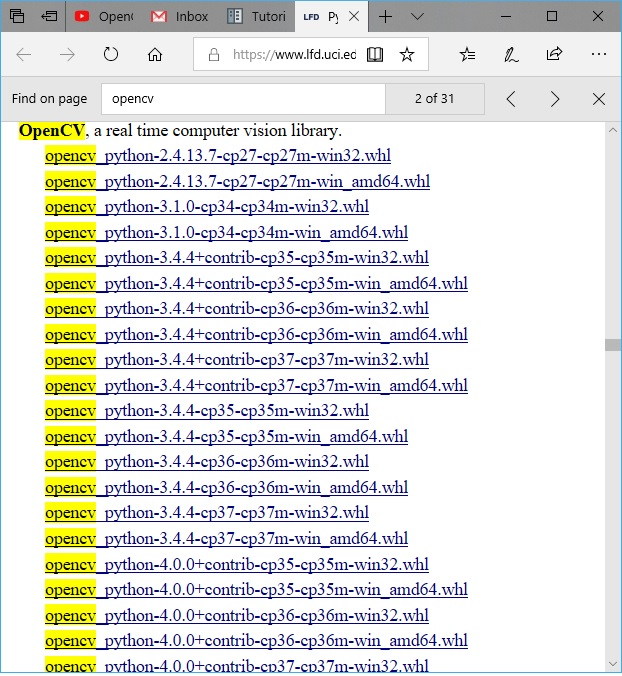
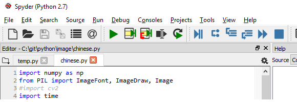

# Install cv2 (OpenCV) to Anaconda

cv2 package is not in Anaconda repository. Follow the steps below to install it, assuming the python IDE is Spyder.

1. Goto [https://www.lfd.uci.edu/~gohlke/pythonlibs/](https://www.lfd.uci.edu/~gohlke/pythonlibs/)
2. Search _opencv_ 

3. Find .whl file that matches your python version. See screen shot below for python version used by Spyder 
4. Save the .whl file to \<anaconda-home> directory (can be any other place)
5. In Anaconda Navigator, select environment that needs to install cv2 package, and select "Open Terminal".
6. Goto \<anaconda-home>/envs/\<env-name> directory. You can skip step 5 and come here from a standard CMD window. and run
    >activate \<env-name>
7. Verify \<env-name> shows before directory path in CMD window.
8. install the downloaded .whl file
    >pip install \<path-to-download-file>
9. To verify cv2 package installation, in Spyder console type
    >\>\>\> import cv2

