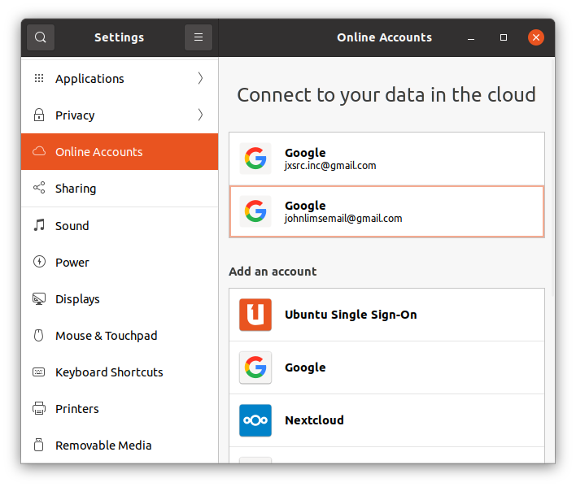

# Ubuntu

## Boot HP Envy Laptop from USB

1) Insert the USB flash drive into a USB port and turn on the computer. 2) Immediately press the Escape key repeatedly, about once every second, until the Startup Menu opens. 3) Press F9 to open the Boot Device Options menu. 4) Use the up or down arrow key to select the USB flash drive, and then press Enter .

## Install Ubunto 20.4

check add Wifi option no matter choose standard (recommended) minimal installation. If not, Wifi driver will not be available. To install Wifi driver, wired connection is required.

## List package
```
dpkg --list | grep <package name>
```

## Grep: ignore word, UPPER and LOWER
```
grep -i <pattern>
```

## Print environment variables
```
printenv
```

## Create environment variable in user environment
open *__.bashrc__* file in user home folder and add export statement as below.
```
export variable-name=variable-value
```
NOTE: Environment variable name is case sensitive (not like Windows where it is not case sensitive). Must relogin as user to make added environment variables active.

## locate utility
```
locate <module name>
```

## USB 
When USB connected to this laptop, the mount name should show in left list in Files. Its parent folder is __/media/john__. If the mount name is __UUI__, then the path to USB is
```
/media/john/UUI
```

## Check disk space
```
df -h
```

## Create desktop shotcut

Example: anaconda

1. create anaconda.desktop file in ~/Desktop
2. copy anaconda.desktop to ~/.local/share/applications
3. click shotcut image/icon in desktop GUI and allow launtch it 

## Create screen shot
1. Print Screen to take a screenshot of the desktop.
2. Alt + Print Screen to take a screenshot of a window.
3. Shift + Print Screen to take a screenshot of an area you select.

Use __screenshots__ application to select how to save screenshot.

1. Open/Click __Activities__
2. Type 'screenshots' in search to find and open __screenshots__ application. (You will see the application when just type 1 (s) or 2 (sc) letter)
3. Select how to make screenshot
4. Before __screenshots__ completes its work, it will promotes a windor for you to choose _copy to clickboard_ or _save_. Under _save_ option, you can specify where to save the screenshot. The default folder to save screenshot is Picture.


## Install Google online account
1. Open ubuntu _Settings_
2. Select _Online Accounts_ 
3. Select _Google_ under _Add an account_

4. Follow instruction to complete work

## Allow Remote Access
enable firewall
> sudo ufw enable
check firewall status
> sudo ufw status

## [Stop and Update _Snap Store_](https://askubuntu.com/questions/1430194/how-to-stop-snap-store-for-update)
```
snap-store --quit
sudo snap refresh
```
## Install google-drive-ocamlfuse
Click [link](https://linuxhint.com/google_drive_installation_ubuntu/#:~:text=To%20add%20your%20Google%20Drive,in%20to%20your%20Google%20account.) and follow the instruction to instaill _ocamlfuse_. 

## Installation Issues of google-drive-ocamlfuse

1. If see error "h_ttps://cli.github.com/packages focal InRelease: The following signatures couldn't be verified because the public key is not available: NO_PUBKEY 23F3D4EA75716059" when doing "__sudo apt update && sudo apt install google-drive-ocamlfuse__", follow [link](https://chrisjean.com/fix-apt-get-update-the-following-signatures-couldnt-be-verified-because-the-public-key-is-not-available/) or do following shell command to load pubkey
    >$ sudo apt-key adv --keyserver keyserver.ubuntu.com --recv-keys 23F3D4EA75716059

2. If mounted google-drive lost (nothing shows in previously mounted location), use shell command below to re-mount it. 
    >google-drive-ocamlfuse ~/myGoogleDrive

    Note: reinstall _google-drive-icanlfuse_ does not fix issue. In _google-drive-icanlfuse_ setup step, the third step in installation, no error when running shell command "google-drive-icanlfuse", but no webpage pops up in browser. It may mean no change to _google-drive-icanlfuse_. And remount makes _google-drive-icanlfuse_ available in file system.

    __Note__: when mounting Google Drive to _~/myGoogleDrive_, __~/myGoogleDrive__ must be an __empty folder__. If not, clean the folder and then mount it for Google Drive.

